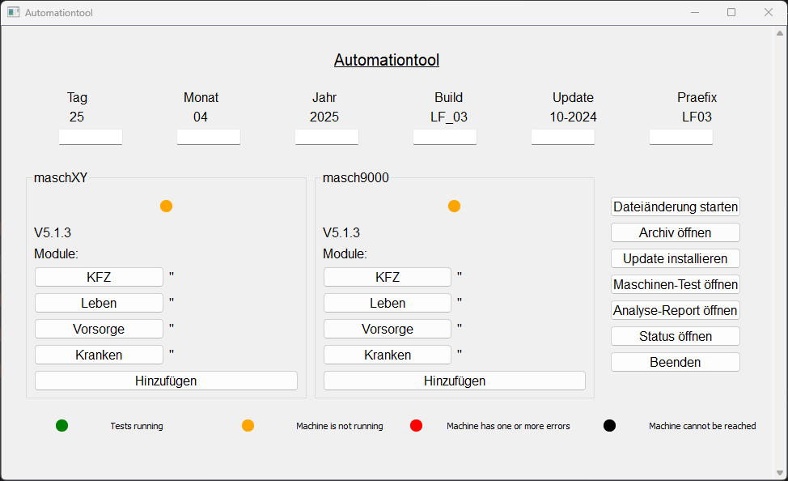
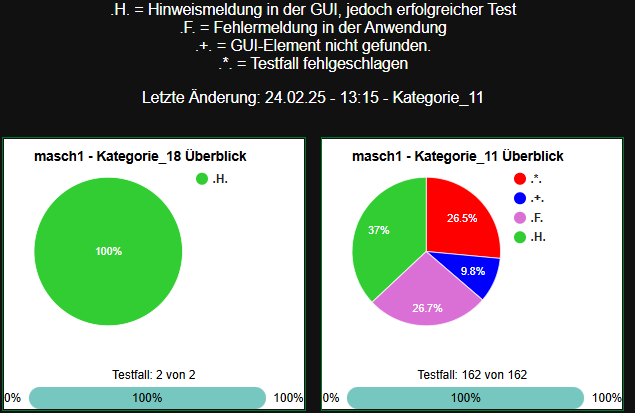

# Automationtool
The tool for supporting automated tests. It includes the automated modification of virtual machine configuration files as well as automated installation and test execution. In addition, a local HTML application is created for the early detection of errors in the test run, visible as a pie chart. And much more.

## Setup
- pip install -r requirements.txt
- install_openssh.bat - insert and execute on each machine. Then establish an SSH connection (host VM) to the machines.


## SSH connection
1. generate SSH key on the machine:

* ssh-keygen
    * Follow the instructions and press Enter to accept the default values.

2. copy the public key to the target computer:
* ssh-copy-id john@192.168.1.100
    * Enter the password of the user john.

3. establish SSH connection with key:

* ssh john@192.168.1.100
    * After these steps, you can log on to the target computer without having to enter the password again as long as the public key is available in the ~/.ssh/authorized_keys file of the user on the target computer.


machines.json, which is created at the first start:
```
{
    "machine100": {
        "modul": ["Modul_1", "Modul_2", "Modul_3", "Modul_4"],
        "path": "\\HOSTNAME\\RELEASE\\MODULE\\PATH\\TO\\YOUR\\DATA.ini"
    },
    ...
    .
}
```
## Note
It is important to customize this tool to fit your own environment and requirements.


## Tool looks like:

----

